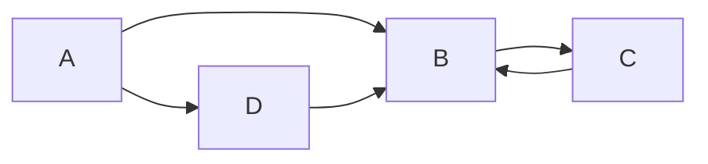
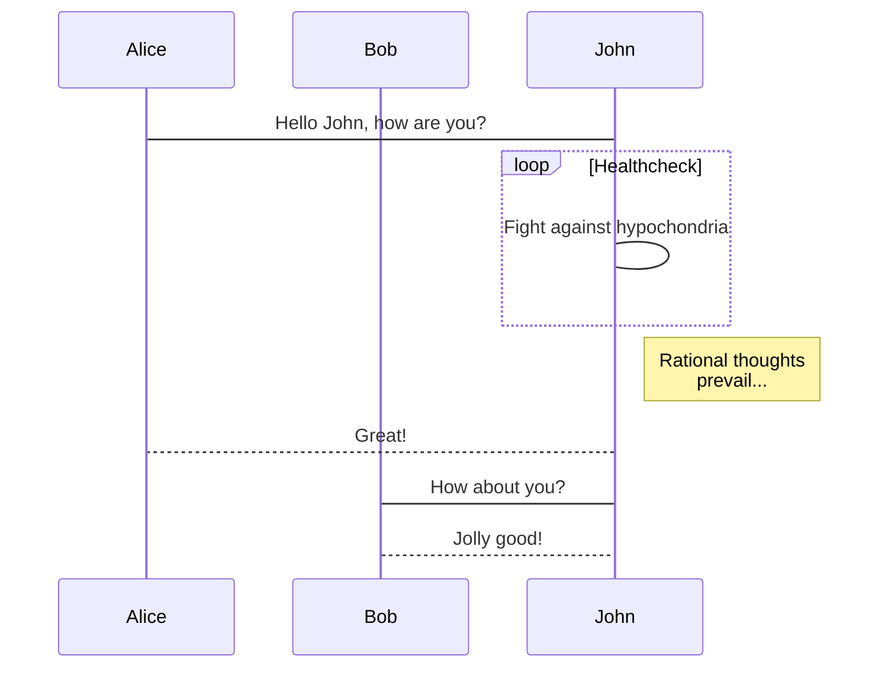
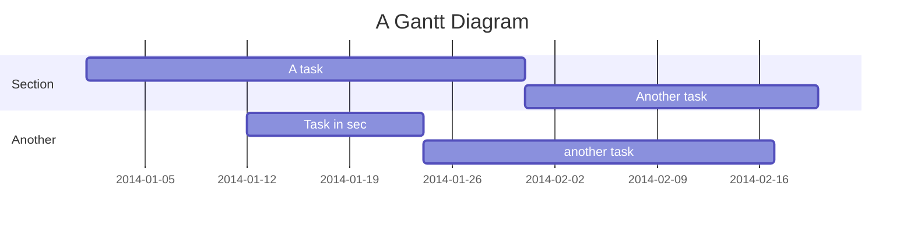
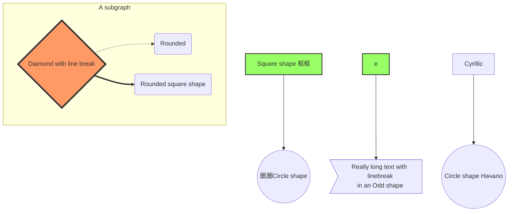

## <p align="center"> Cpython Internals笔记 </p>
#### 1. 基本概念
1. xxx




2. ss
```python
import utils
```

#### 2. Compiler
1. xxx
2. xxx
3. ccc
4. vvv

#### 3. sss

#### 4. Stack

#### 5. Interpreters

#### 6. x

#### 7. s

#### 8. s

#### 9. s

#### 10. s

#### 11. s
