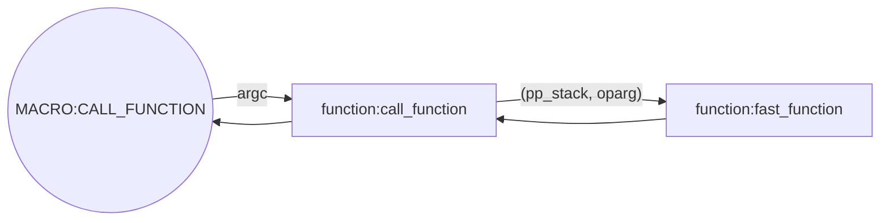

## <p align="center"> Cpython Internals笔记 </p>
##### Lecture 1 - Interpreter and source code overview
1. Interpreter and source code overview.
```mermaid
graph LR;
   srcode[source code]==>compiler((compiler:</br>Standard));
   compiler==>bytecode[bytecode]
   bytecode==>interpreter(interpreter);
   interpreter==>output;
   subgraph 重点关注
   bytecode
   interpreter
   output
   end
   style compiler fill:#fff,stroke:#1cc,stroke-width:2px,stroke-dasharray:5,5;
   style interpreter fill: #f40;
```

##### Lecture 2 - Opcodes and main interpreter loop
1. 获取bytecode用到的主要命令:
	```python
	# -------------------------------------------
	import dis
	dis.dis(mod)	# 使用dis模块获取mod的bytecode
	# -------------------------------------------
	c = compile(open('test.py').read(), 'test.py', 'exec')	# 返回code object
	# 返回bytecode的数字编码 [100, 0, 0, 90, 0, 0, 100,....]
	[ord(byte) for byte in c.co_code]
	dis.dis(c)	# 返回bytecode
	dir(c) # 返回c中主要信息
	c.co_code # 返回汇编代码
	c.co_consts # 返回常量元组
	```
	```shell
	python -m dis test.py
	```
	*可用byteplay包替代上述命令获得更好的反编译效果

2. 代码注释
	1. **Python/ceval.c**
		- ines 693-3021: main interpreter, operate one frame(equivalent one function), returns a python object to whoever calls this function.
		```cpp
		PyObject *PyEval_EvalFrameEx(PyFrameObject *f, int throwflag){
		// line 689-730: define locale variables to store the locale states
		// line 698: The pointer to the value stack
		register PyObject **stack_pointer; /* Next free slot in value stack */
		// line 825-858: stack manipulation macros
		// line 919-945: grab everything out from code(frame)
		// line 964: a giant infinite loop: go through the bytecode one byte a time
		for (;;) {
			// line 1080: Extract the next opcode
			opcode = NEXTOP();
			// line 1083: Extract args if have arg
			if (HAS_ARG(opcode))
            	oparg = NEXTARG();
			}
			// line 1112: Execute the opcode by switch.
			switch (opcode) {
				// Py_DECREF/Py_INCREF is used to support the reference count Garbage Collection: like Py_DECREF(v) in POP_TOP.
				CASE LOAD_FAST: ... break;
				CASE LOAD_CONST: ... break;
				}
			// line 2959-2960: kick out the infinite loop
			if (why != WHY_NOT)
            	break;
			// clean up
			}
		// line 3020: return the result value
		return retval;
		}
		```

##### Lecture 3 - Frames, function calls, and scope
1. 函数调用相关指令
	
	
2. **Include/code.h**: defined the python code object(PyCodeObject).
	
3. **Include/frameobject.h**: defined the frame object(PyFrameObject).
	
4. Terminology Clarity:
	- Code: The most primitive thing, a bunch of bytecode. A Code Object has bytecode, and also has some extra semantic information like constants, variable names.
	- Function: A function has a code object, and also has a environment  pointer to where was defined.
	- Frame: Also has a code object, also has a environment pointer, it's the representation of code at runtime while running it.
	
5. About the CALL_FUNCTION instruction:
	1. line 2671-2686 in **ceval.c**: instruction **CALL_FUNCTION(argc)**，CALL_FUNCTION instruction only need get the argument argc(the low byte of argc indicates the number of positional arguments, high byte number of keyword parameters) from the stack, and interpreter will get proper parameters from stack automatically.
	```cpp
	case CALL_FUNCTION:
        {
            PyObject **sp;
            PCALL(PCALL_ALL);
            sp = stack_pointer;
			#ifdef WITH_TSC
            x = call_function(&sp, oparg, &intr0, &intr1);
			#else
            x = call_function(&sp, oparg);
			#endif
            stack_pointer = sp;
            PUSH(x);
            if (x != NULL)
                continue;
            break;
        }
	```
	2. line 3991-4071 in **ceval.c**: **call_function(栈指针, 参数数量oparg)**,只需传递参数数量，具体参数从栈中获取，返回值最终被PUSH(x)语句压入当前栈中。
	```cpp
	static PyObject *call_function(PyObject ***pp_stack, int oparg)
	{
	// na: number of positional parameters
    int na = oparg & 0xff;
	// nk: number of keyword parameters
    int nk = (oparg>>8) & 0xff;
    int n = na + 2 * nk;
    PyObject **pfunc = (*pp_stack) - n - 1;
    PyObject *func = *pfunc;
    PyObject *x, *w;

    /* Always dispatch PyCFunction first, because these are
       presumed to be the most frequent callable object.
    */
    if (PyCFunction_Check(func) && nk == 0) {
     ... handle a C function
    } else {
		/* If it's a regular Python Function, call the fast_function(...) */
        if (PyFunction_Check(func))
            x = fast_function(func, pp_stack, n, na, nk);
        else
            x = do_call(func, pp_stack, na, nk);
		Py_DECREF(func);
    	}
    /* Clear the stack of the function object.  Also removes
       the arguments in case they weren't consumed already
       (fast_function() and err_args() leave them on the stack).
     */
    while ((*pp_stack) > pfunc) {
        w = EXT_POP(*pp_stack);
        Py_DECREF(w);
        PCALL(PCALL_POP);
    }
    return x;
	}
	```
	3. line 4082-4133 in ceval.c: fast_function(函数对象指针, 栈指针, 所有参数在栈中占据空间, 位置参数数量，键参数数量):根据传入的参数从栈中获得参数执行函数对象返回PyObject对象
	```cpp
	static PyObject *
	fast_function(PyObject *func, PyObject ***pp_stack, int n, int na, int nk)
	{
		PyCodeObject *co = (PyCodeObject *)PyFunction_GET_CODE(func);
    	PyObject *globals = PyFunction_GET_GLOBALS(func);
    	PyObject *argdefs = PyFunction_GET_DEFAULTS(func);
		// Create a new frame and assign to f
		PyFrameObject *f;
		f = PyFrame_New(tstate, co, globals, NULL);
		// Copy arguments from the stack into the new frame
		// f_localsplus is the storage for localvariables and value stacks in the new frame(see last line of the definition of PyFrameObject above)
		fastlocals = f->f_localsplus;
		// stack is the old stack from calling function
        stack = (*pp_stack) - n;
		// copy arguments from old frame to the new one	(n = na + 2 * nk), this operation implements the passing of parameters from caller to the calee.
        for (i = 0; i < n; i++) {
            Py_INCREF(*stack);
            fastlocals[i] = *stack++;
		}
		// Call the function PyEval_EvalFrameEx(See Lecture2.2.1) that execute the interpreter main loop on the new frame we just created.
		retval = PyEval_EvalFrameEx(f,0);
        ++tstate->recursion_depth;
        Py_DECREF(f);
        --tstate->recursion_depth;
		// 返回执行结果，该结果经过上述几个函数层层返回后最终被压入调用了CALL_FUNCTION指令的FRAME的VALUE STACK中
        return retval;
	}
	```

	4. 图形表述整个CALL_FUNCTION指令执行过程：



##### Lecture 4 - PyObject: The core Python object

##### Lecture 5 - Example Python data types

##### Lecture 6 - Code objects, function objects, and closures

##### Lecture 7 - Iterators

##### Lecture 8 - User-defined classes and objects

##### Lecture 9 - Generators
