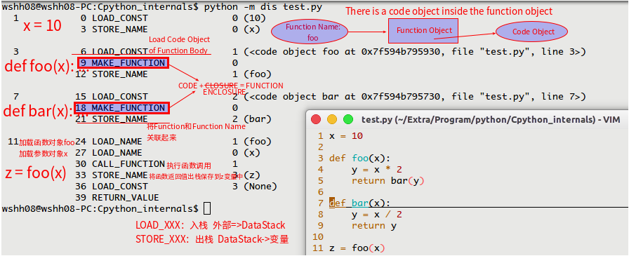
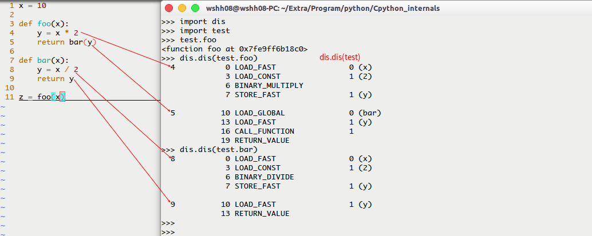
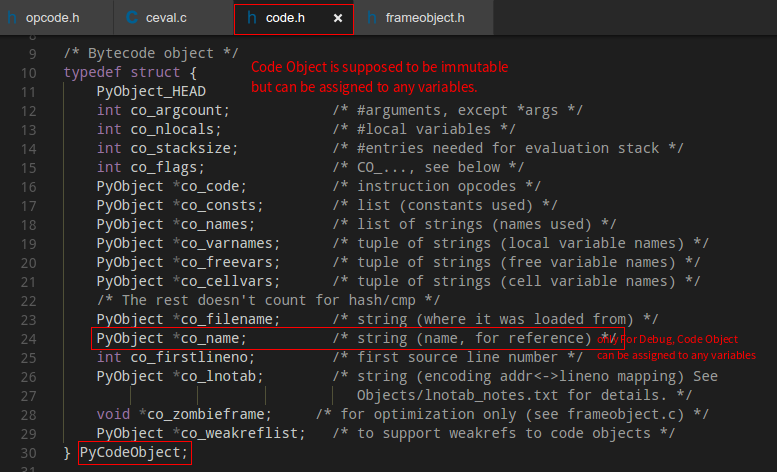
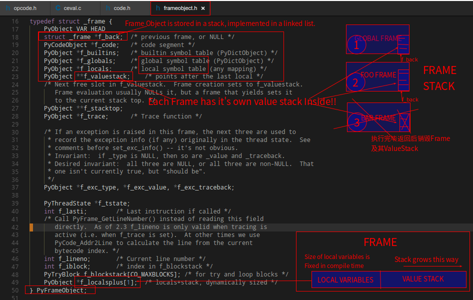
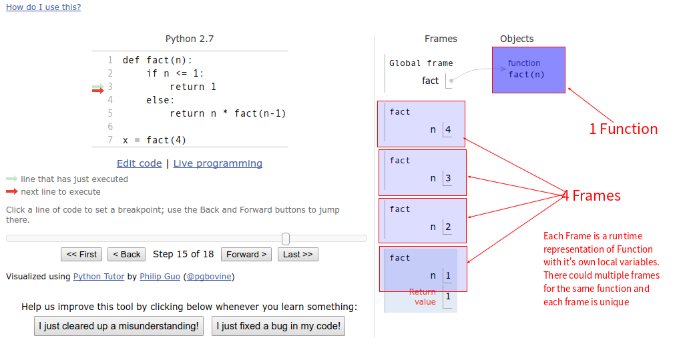
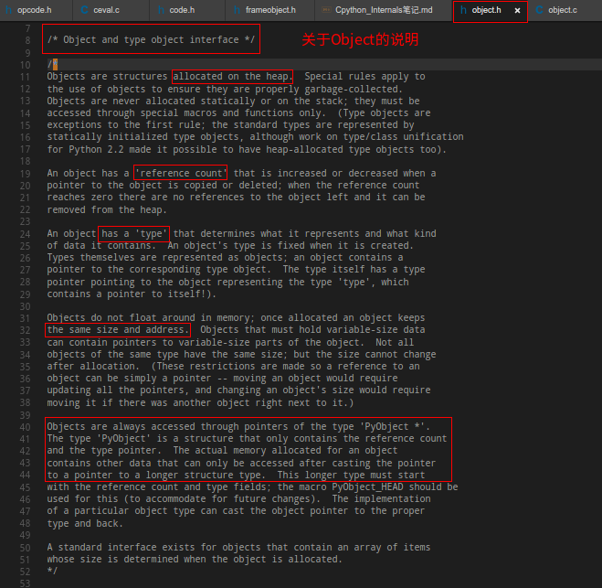
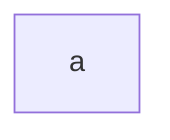

# <p align="center"> Cpython Internals笔记 </p>

#### Lecture 1 - Interpreter and source code overview

1. Interpreter and source code overview.

	```mermaid
	graph LR;
	   srcode[source code]==>compiler((compiler:<br>Standard));
	   compiler==>bytecode[bytecode]
	   bytecode==>interpreter(interpreter);
	   interpreter==>output;
	   subgraph Emphasis
	   bytecode
	   interpreter
	   output
	   end
	   style compiler fill:#fff,stroke:#1cc,stroke-width:2px,stroke-dasharray:5,5;
	   style interpreter fill: #f40;
	```

##### Lecture 2 - Opcodes and main interpreter loop

1. 获取bytecode用到的主要命令:

	```python
	# -------------------------------------------
	import dis
	dis.dis(mod)	# 使用dis模块获取mod的bytecode
	# -------------------------------------------
	c = compile(open('test.py').read(), 'test.py', 'exec')	# 返回code object
	# 返回bytecode的数字编码 [100, 0, 0, 90, 0, 0, 100,....]
	[ord(byte) for byte in c.co_code]
	dis.dis(c)	# 返回bytecode
	dir(c) # 返回c中主要信息
	c.co_code # 返回汇编代码
	c.co_consts # 返回常量元组
	```
	```shell
	python -m dis test.py
	```
	*可用byteplay包替代上述命令获得更好的反编译效果<br>
1. 关键代码注释
	1. **Python/ceval.c**
		- ines 693-3021: main interpreter, operate one frame(equivalent one function), returns a python object to whoever calls this function.
		```cpp
		PyObject *PyEval_EvalFrameEx(PyFrameObject *f, int throwflag){
		/* line 689-730: define locale variables to store the locale states
		 * line 698: The pointer to the value stack
		 */
		register PyObject **stack_pointer; /* Next free slot in value stack */
		/* line 825-858: stack manipulation macros
		 * line 919-945: grab everything out from code(frame)
		 * line 964: a giant infinite loop: go through the bytecode one byte a time
		 */
		for (;;) {
			// line 1080: Extract the next opcode
			opcode = NEXTOP();
			// line 1083: Extract args if have arg
			if (HAS_ARG(opcode))
            	oparg = NEXTARG();
			}
			// line 1112: Execute the opcode by switch.
			switch (opcode) {
				/* Py_DECREF/Py_INCREF is used to support the reference count
				   Garbage Collection: like Py_DECREF(v) in POP_TOP.
				*/
				CASE LOAD_FAST: ... break;
				CASE LOAD_CONST: ... break;
				}
			// line 2959-2960: kick out the infinite loop
			if (why != WHY_NOT)
            	break;
			// clean up
			}
		// line 3020: return the result value
		return retval;
		}
		```

##### Lecture 3 - Frames, function calls, and scope

1. 函数调用相关指令预览
	
	
1. Definition of code object (PyCodeObject) - **Include/code.h**
    
1. Definition of the frame object(PyFrameObject) - **Include/frameobject.h**
	
1. Terminology Clarity:
	- **Code**: The most primitive thing, a bunch of bytecode. A Code Object has bytecode, and also has some extra semantic information like constants, variable names.
	- **Function**: A function has a code object, and also has a environment  pointer to where was defined.
	- **Frame**: Also has a code object, also has a environment pointer, it's the representation of code at runtime while running it.
	
1. Detail about the CALL_FUNCTION instruction:
	- line 2671-2686 in **ceval.c**: instruction **CALL_FUNCTION(argc)**，CALL_FUNCTION instruction only need get the argument argc(the low byte of argc indicates the number of positional arguments, high byte number of keyword parameters) from the stack, and interpreter will get proper parameters from stack automatically.

	```cpp
	case CALL_FUNCTION:
        {
            PyObject **sp;
            PCALL(PCALL_ALL);
            sp = stack_pointer;
			#ifdef WITH_TSC
            x = call_function(&sp, oparg, &intr0, &intr1);
			#else
            x = call_function(&sp, oparg);
			#endif
            stack_pointer = sp;
            PUSH(x);
            if (x != NULL)
                continue;
            break;
        }
	```

	- line 3991-4071 in **ceval.c**: **call_function(栈指针, 参数数量oparg)**,只需传递参数数量，具体参数从栈中获取，返回值最终被PUSH(x)语句压入当前栈中。

	```cpp
	static PyObject *call_function(PyObject ***pp_stack, int oparg)
	{
	  // na: number of positional parameters
      int na = oparg & 0xff;
	  // nk: number of keyword parameters
      int nk = (oparg>>8) & 0xff;
      int n = na + 2 * nk;
      PyObject **pfunc = (*pp_stack) - n - 1;
      PyObject *func = *pfunc;
      PyObject *x, *w;

      /* Always dispatch PyCFunction first, because these are
         presumed to be the most frequent callable object.
      */
      if (PyCFunction_Check(func) && nk == 0) {
       ... handle a C function
      } else {
		  /* If it's a regular Python Function, call the fast_function(...) */
          if (PyFunction_Check(func))
              x = fast_function(func, pp_stack, n, na, nk);
          else
              x = do_call(func, pp_stack, na, nk);
		  Py_DECREF(func);
        }
      /* Clear the stack of the function object.  Also removes
         the arguments in case they weren't consumed already
         (fast_function() and err_args() leave them on the stack).
      */
      while ((*pp_stack) > pfunc) {
          w = EXT_POP(*pp_stack);
          Py_DECREF(w);
          PCALL(PCALL_POP);
      }
      return x;
	}
	```
	- line 4082-4133 in ceval.c: fast_function(函数对象指针, 栈指针, 所有参数在栈中占据空间, 位置参数数量，键参数数量):根据传入的参数从栈中获得参数执行函数对象返回PyObject对象

	```cpp
	static PyObject *
	fast_function(PyObject *func, PyObject ***pp_stack, int n, int na, int nk)
	{
		PyCodeObject *co = (PyCodeObject *)PyFunction_GET_CODE(func);
    	PyObject *globals = PyFunction_GET_GLOBALS(func);
    	PyObject *argdefs = PyFunction_GET_DEFAULTS(func);
		// Create a new frame and assign to f
		PyFrameObject *f;
		f = PyFrame_New(tstate, co, globals, NULL);
		/* Copy arguments from the stack into the new frame
		 * f_localsplus is the storage for localvariables and
		 * value stacks in the new frame(see last line of the definition of PyFrameObject above)
		*/
		fastlocals = f->f_localsplus;
		// stack is the old stack from calling function
        stack = (*pp_stack) - n;
		/* copy arguments from old frame to the new one	(n = na + 2 * nk),
		 * this operation implements the passing of parameters from caller to the calee.
		 */
        for (i = 0; i < n; i++) {
            Py_INCREF(*stack);
            fastlocals[i] = *stack++;
		}
		/* Call the function PyEval_EvalFrameEx(See Lecture2.2.1) that execute
		   the interpreter main loop on the new frame we just created.
		*/
        retval = PyEval_EvalFrameEx(f,0);
        ++tstate->recursion_depth;
        Py_DECREF(f);
        --tstate->recursion_depth;
		/* 返回执行结果，该结果经过上述几个函数层层返回后
		   最终被压入调用了CALL_FUNCTION指令的FRAME的VALUE STACK中
		*/
        return retval;
	}
	```

	- 流程图表述整个CALL_FUNCTION指令执行过程：

	```mermaid
	graph LR;
		CALLFUNCTION(MACRO:CALL_FUNCTION<br>1. 将栈指针和argc传递给call_function函数<br>2. 接收返回值然后压入调用者栈中)--argc-->callfunction[function:call_function<br>根据CALL_FUNCTION指令传递过来的argc参数计算<br>位置参数和关键字参数的数量并从调用者栈中获取<br>Function Object 将Function Object及参数数量等<br>信息作为参数召唤fast_function.];
		callfunction--pp_stack, oparg-->fastfunction[function:fast_function<br>创建Frame对象,将参数从调用者栈中复制<br>到新Frame中,最终将新建的Frame对象传递<br>给执行解释器主循环的PyEval_EvalFrameEx函数.<br>执行完成后将结果retval返回上一级调用者];
		fastfunction--return retval-->callfunction;
		callfunction--return x-->CALLFUNCTION;

	```

##### Lecture 4 - PyObject: The core Python object

1. Overview
	- Inspect an object in Python: ```dir(obj)```-show everyting(Methods, Properties and so on) inside the mode.
	- Everthing in python is an object even a number like 123(instance of PyIntObject), thist is less efficient than C or Java which store numbers directly, but Override an object to add extra features is more flexible.
	- Interface of Python always work with PyObjects, everthing should be wrapped in a python object to be handled in Python. There is implemention of every signle type object(see source code in Object/xxxobject.c).
	- ```id(x)``` return memory location of an object. In python once an object is evaluated, it's memory location won't be changed.
	- ```type(x)``` return type information of an object, every object not only has a id, but also has type information.
	- 查看对象引用数的语句：
	```python
	from sys import getrefcount
	x = ['a', 'b', 'c']
	getrefcount(x)
	```
1. Contents of a generic PyObject:
	

	```viz
	digraph Python_Object {
		node [shape=record];
		Object[label="{Python Object | {  id |<f0>type | <f1>value | reference-count | ...}}"];
		Type[label="str | list | <f0>int |..."];
		Value[label="a number | <f0>a string | a list | ..."];
		Object:f0 -> Type:f0;
		Object:f1 -> Value:f0;
		PyObject[label="{PyObject | {type pointer | reference-count}}"]
	}
	```
1. Python Objects in the C world(C structual subtype: utilize the same field in C struct to create a type hierarchical in C)
	```viz
	digraph Objects_in_C_world {
		node [shape=record];
		PyObject[label="{PyObject(C struct)|{{Type|Ref-count}|{<f0>pointer|2}}}"]
		PyIntObject[label="{PyIntObject(C struct)|{{Type|Ref-count|Value}|{<f0>pointer|2|30}}}"]
		PyTypeObject[label="{<f1>PyTypeObject(C struct)|{{Type|Ref-count|Value}|{<f0>pointer|5|\"int\"/...}}}"]
		PyTypeObject_type[label="{<f1>PyTypeObject(C struct)|{{Type|Ref-count|Value}|{<f0>pointer|5|\"Type\"}}}"]
		pPyObject[label="*PyObject"];
		PyObject:f0 -> PyTypeObject;
		PyIntObject:f0 -> PyTypeObject;
		PyTypeObject:f0 -> PyTypeObject_type:f1
		PyTypeObject_type:f0 -> PyTypeObject_type:f1
		pPyObject -> {PyObject PyIntObject PyTypeObject PyTypeObject_type}
	}
	```
1. 代码解析
	- line 77-81 and line 101-108 and line 114-116 in **Include/object.h**
	```c
	/* PyObject_HEAD defines the initial segment of every PyObject.
	 * _PyObject_HEAD_EXTRA is always empty
	 */
	#define PyObject_HEAD                   \
   		_PyObject_HEAD_EXTRA                \
   		Py_ssize_t ob_refcnt;               \
   		struct _typeobject *ob_type;
	/* Nothing is actually declared to be a PyObject, but every pointer to
	 	 * a Python object can be cast to a PyObject*.  This is inheritance built
		 * by hand.  Similarly every pointer to a variable-size Python object can,
		 * in addition, be cast to PyVarObject*.
		 */
	typedef struct _object {
   		PyObject_HEAD
	} PyObject;

	/* Macros to get reference count, type and size from Python Objects */
	#define Py_REFCNT(ob)           (((PyObject*)(ob))->ob_refcnt)
	#define Py_TYPE(ob)             (((PyObject*)(ob))->ob_type)
	#define Py_SIZE(ob)             (((PyVarObject*)(ob))->ob_size)

	```
	- line 25-26 in **Include/intobject.h**
	```c
	typedef struct {
	    PyObject_HEAD	// Type & Reference Count
	    long ob_ival;	// Value
	} PyIntObject;
	```
	- **Objects/object.c**: generic thing can be done to an object
	```c
	// line 240-248: How was an object created
	PyObject *
	_PyObject_New(PyTypeObject *tp)
	{
	    PyObject *op;
		/* Allocate new memory and put it to a PyObject pointer 'op' */
	    op = (PyObject *) PyObject_MALLOC(_PyObject_SIZE(tp));
	    if (op == NULL)
	        return PyErr_NoMemory();
		/* Call the constructor to initialize the object */
	    return PyObject_INIT(op, tp);
	}
	// line 448-467 and line 406-446: How was an object converted to a string
	PyObject *
	PyObject_Str(PyObject *v)
	{
	    PyObject *res = _PyObject_Str(v);
	    if (res == NULL)
	        return NULL;
	#ifdef Py_USING_UNICODE
	    if (PyUnicode_Check(res)) {
	        PyObject* str;
	        str = PyUnicode_AsEncodedString(res, NULL, NULL);
	        Py_DECREF(res);
	        if (str)
	            res = str;
	        else
	            return NULL;
	    }
	#endif
	    assert(PyString_Check(res));
	    return res;
	}

	PyObject *
	_PyObject_Str(PyObject *v)
	{
	    PyObject *res;
	    int type_ok;
	    if (v == NULL)
	        return PyString_FromString("<NULL>");
	    if (PyString_CheckExact(v)) {
	        Py_INCREF(v);
	        return v;
	    }
	#ifdef Py_USING_UNICODE
	    if (PyUnicode_CheckExact(v)) {
	        Py_INCREF(v);
	        return v;
	    }
	#endif
	    if (Py_TYPE(v)->tp_str == NULL)
	        return PyObject_Repr(v);

	    /* It is possible for a type to have a tp_str representation that loops
	       infinitely. */
	    if (Py_EnterRecursiveCall(" while getting the str of an object"))
	        return NULL;
		/* Every type that can be converted to String should have
		   implemented the tp_str method. This is where the
		   dynamic(One Interface call tp_str, and each type
		   implements it's own version of tp_str) comes in.
		   This is the thing that jump into the specific code
		   for each type.
		 */
	    res = (*Py_TYPE(v)->tp_str)(v);
	    Py_LeaveRecursiveCall();
	    if (res == NULL)
	        return NULL;
	    type_ok = PyString_Check(res);
	#ifdef Py_USING_UNICODE
	    type_ok = type_ok || PyUnicode_Check(res);
	#endif
	    if (!type_ok) {
	        PyErr_Format(PyExc_TypeError,
	                     "__str__ returned non-string (type %.200s)",
	                     Py_TYPE(res)->tp_name);
	        Py_DECREF(res);
	        return NULL;
	    }
	    return res;
	}

	```

##### Lecture 5 - Example Python data types

1. Objective of this lecture: To understand how Python data types are "subtypes" of the core PyObject.
	- Intro to Python sequence types -- tuples, lists, strings
	- Abstract object interface: **Objects/abstract.c**
	- String type: **Objects/stringobject.c**

##### Lecture 6 - Code objects, function objects, and closures

##### Lecture 7 - Iterators

##### Lecture 8 - User-defined classes and objects

##### Lecture 9 - Generators

没有这个↓↓↓在markdown_preview_enhanced中预览前面的mermaid图都会乱(但是在Chrome中打开后显示正常)，不知为何



```viz
digraph G {
  rankdir=LR
  node [shape=plaintext]
  a [
     label=<
<TABLE BORDER="0" CELLBORDER="1" CELLSPACING="0">
  <TR><TD ROWSPAN="3" BGCOLOR="yellow">class</TD></TR>
  <TR><TD PORT="here" BGCOLOR="lightblue">qualifier</TD></TR>
</TABLE>>
  ]
    b [shape=ellipse style=filled
  label=<
<TABLE BGCOLOR="bisque">
  <TR><TD COLSPAN="3">elephant</TD> 
      <TD ROWSPAN="2" BGCOLOR="chartreuse" 
          VALIGN="bottom" ALIGN="right">two</TD> </TR>
  <TR><TD COLSPAN="2" ROWSPAN="2">
        <TABLE BGCOLOR="grey">
          <TR> <TD>corn</TD> </TR> 
          <TR> <TD BGCOLOR="yellow">c</TD> </TR> 
          <TR> <TD>f</TD> </TR> 
        </TABLE> </TD>
      <TD BGCOLOR="white">penguin</TD> 
  </TR> 
  <TR> <TD COLSPAN="2" BORDER="4" ALIGN="right" PORT="there">4</TD> </TR>
</TABLE>>
  ]
  c [ 
  label=<long line 1<BR/>line 2<BR ALIGN="LEFT"/>line 3<BR ALIGN="RIGHT"/>>
  ]

  subgraph { rank=same b c }
  a:here -> b:there [dir=both arrowtail = diamond]
  c -> b
  d [shape=triangle]
  d -> c [label=<
<TABLE>
  <TR><TD BGCOLOR="red" WIDTH="10"> </TD>
      <TD>Edge labels<BR/>also</TD>
      <TD BGCOLOR="blue" WIDTH="10"> </TD>
  </TR>
</TABLE>>
  ]
}
```

```viz
digraph structs {
    node [shape=record];
    struct1 [label="<f0> left|<f1> mid&#92; dle|<f2> right"];
    struct2 [label="<f0> one|<f1> two"];
    struct3 [label="hello&#92;nworld |{ b |{c|<here> d|e}| f}| g | h"];
    struct1:f1 -> struct2:f0;
    struct1:f2 -> struct3:here;
}
```

```viz
digraph structs {
    node [shape=plaintext]
    struct1 [label=<
<TABLE BORDER="0" CELLBORDER="1" CELLSPACING="0">
  <TR><TD>left</TD><TD PORT="f1">mid dle</TD><TD PORT="f2">right</TD></TR>
</TABLE>>];
    struct2 [label=<
<TABLE BORDER="0" CELLBORDER="1" CELLSPACING="0">
  <TR><TD PORT="f0">one</TD><TD>two</TD></TR>
</TABLE>>];
    struct3 [label=<
<TABLE BORDER="0" CELLBORDER="1" CELLSPACING="0" CELLPADDING="4">
  <TR>
    <TD ROWSPAN="3">hello<BR/>world</TD>
    <TD COLSPAN="3">b</TD>
    <TD ROWSPAN="3">g</TD>
    <TD ROWSPAN="3">h</TD>
  </TR>
  <TR>
    <TD>c</TD><TD PORT="here">d</TD><TD>e</TD>
  </TR>
  <TR>
    <TD COLSPAN="3">f</TD>
  </TR>
</TABLE>>];
    struct1:f1 -> struct2:f0;
    struct1:f2 -> struct3:here;
}
```

```viz
digraph dfd{
    node[shape=record]
    store1 [label="{<f0> left|<f1> Some data store}"];
    proc1 [label="{<f0> 1.0|<f1> Some process here\n\n\n}" shape=Mrecord];
    enti1 [label="Customer" shape=box];
    store1:f0 -> proc1:f1;
    enti1-> proc1:f0;
}
```

VIM 快捷键：
首先，可以在命令模式下输入v进入自由选取模式，选择需要剪切的文字后，按下d就可以进行剪切了。
其他命令模式下剪切命令：
dd：剪切当前行
ndd：n表示大于1的数字，剪切n行
dw：从光标处剪切至一个单子/单词的末尾，包括空格
de：从光标处剪切至一个单子/单词的末尾，不包括空格
d$：从当前光标剪切到行末
d0：从当前光标位置（不包括光标位置）剪切之行首
d3l：从光标位置（包括光标位置）向右剪切3个字符
d5G：将当前行（包括当前行）至第5行（不包括它）剪切
d3B：从当前光标位置（不包括光标位置）反向剪切3个单词
dH：剪切从当前行至所显示屏幕顶行的全部行
dM：剪切从当前行至命令M所指定行的全部行
dL：剪切从当前行至所显示屏幕底的全部行

yy：复制当前行
nyy：n表示大于1的数字，复制n行
yw：从光标处复制至一个单子/单词的末尾，包括空格
ye：从光标处复制至一个单子/单词的末尾，不包括空格
y$：从当前光标复制到行末
y0：从当前光标位置（不包括光标位置）复制之行首
y3l：从光标位置（包括光标位置）向右复制3个字符
y5G：将当前行（包括当前行）至第5行（不包括它）复制
y3B：从当前光标位置（不包括光标位置）反向复制3个单词